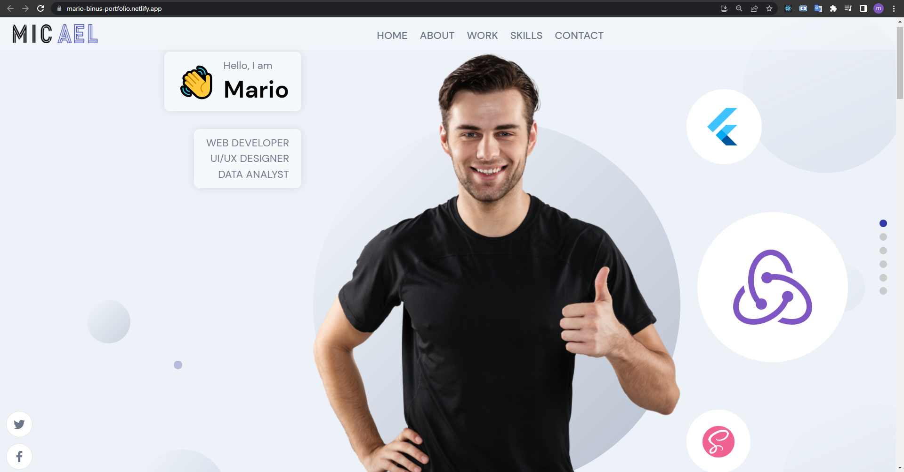
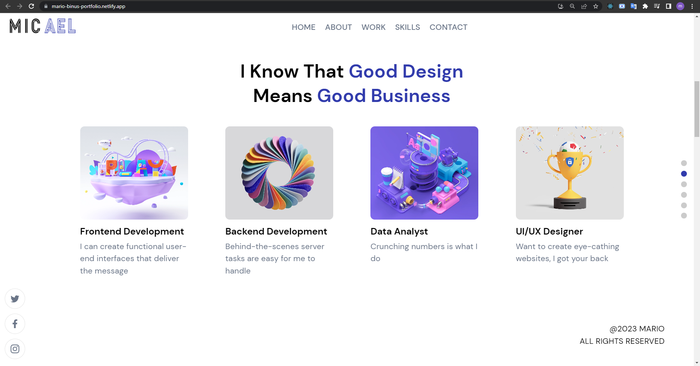
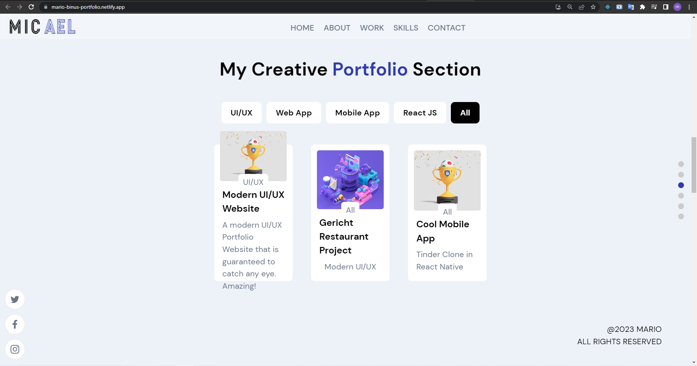
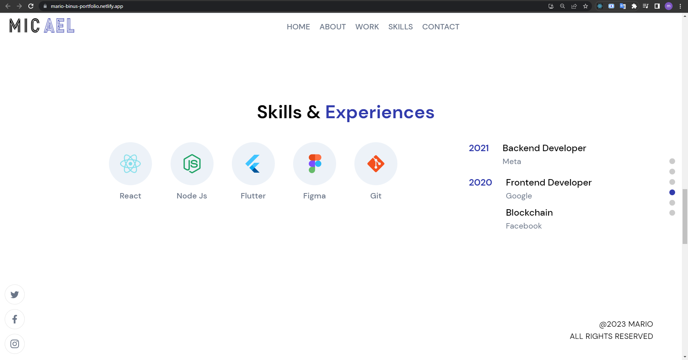
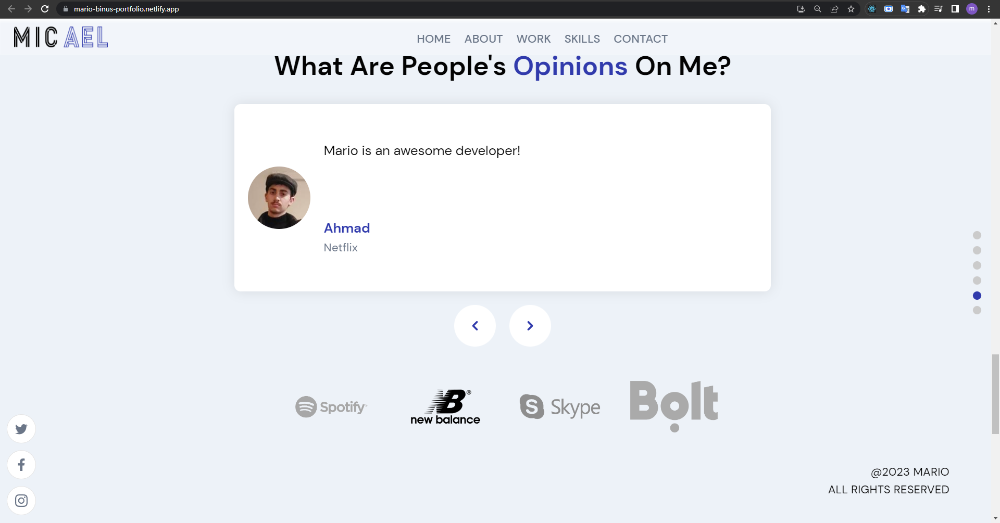
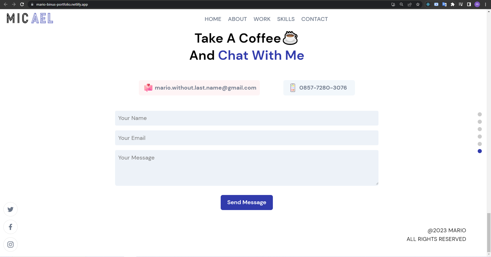

# Personal Portfolio

A personal portfolio projects that showcases my expertise (Does not actually contain my real data yet).

Project made by Mario (with some of my own code modifications).

Project is hosted by Netlify. It can be viewed [here](https://mario-binus-portfolio.netlify.app/).

---

Some screenshots:

---

The tutorial video can be found [here](https://www.youtube.com/watch?v=3HNyXCPDQ7Q).

